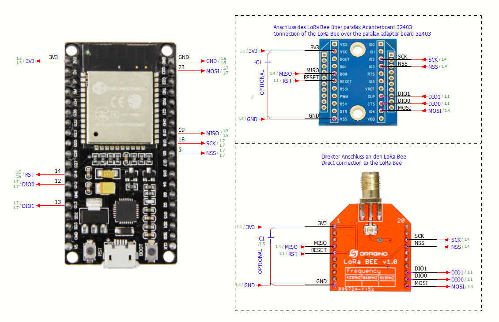

# ESP32 Single Channel Gateway TTN
ESP32 Single Channel Gateway for the things network (TTN)

Simple single channel gatway for the esp32. Threadsafe and interrupt safe functions to acces the modem. Program is tested on the Semtech SX1276. Libs are freezed in the repository to guarantee compatible interfacing with the main programm.

**Features:**

- Tested with TTN v3
- Uses UDP Semtech protocol
- compiled binarys are available
- Up and downstream messages
  
**Open topics**

- readable documentation (documentation atm only in code)
- only tmst property is used of the semtech protocoll

**Used libs:**

ezTime
> <https://github.com/ropg/ezTime>

arduino-esp32
> <https://github.com/espressif/arduino-esp32>

arduino-base64
> <https://github.com/dirkx/base64_arduino>

arduino-json
> <https://github.com/bblanchon/ArduinoJson>

**Connection diagram:**

  